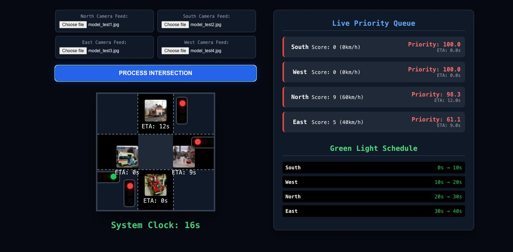
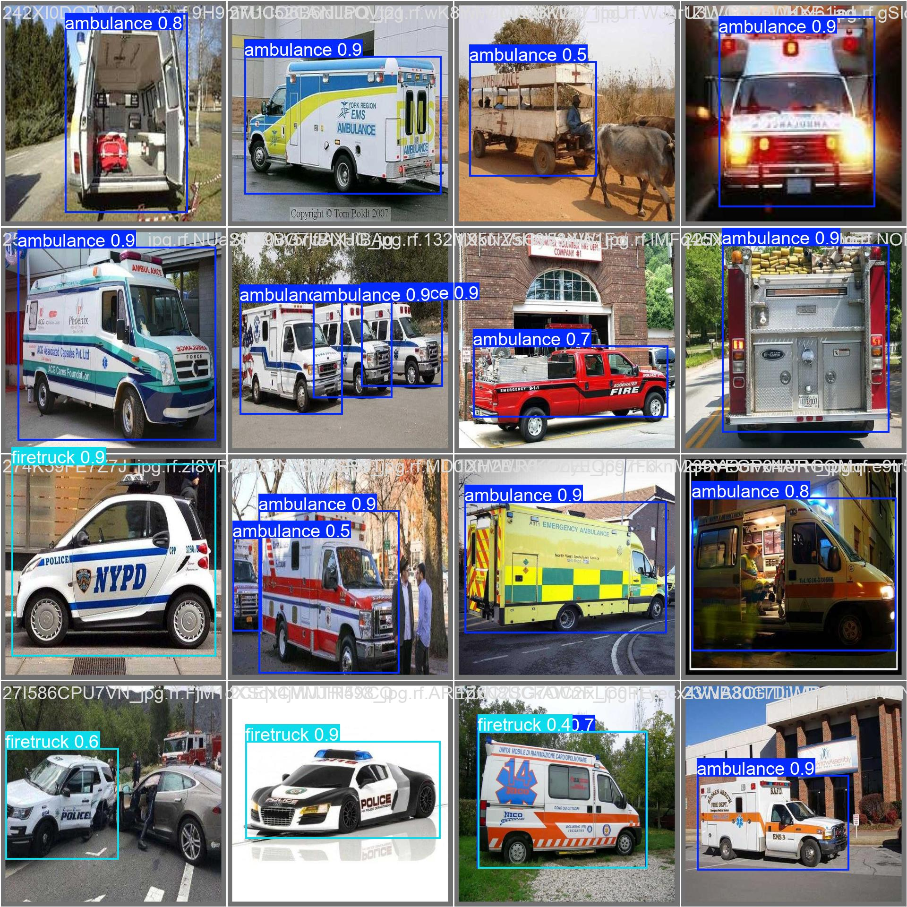
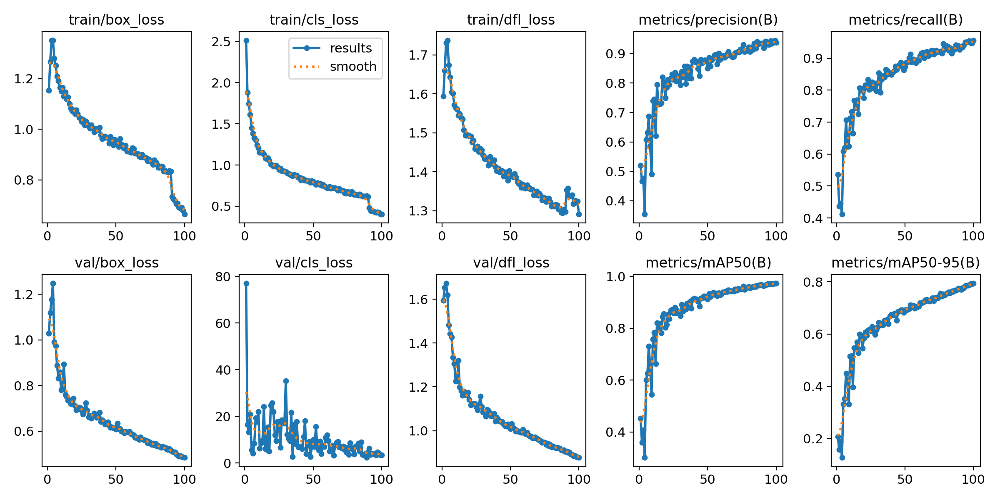
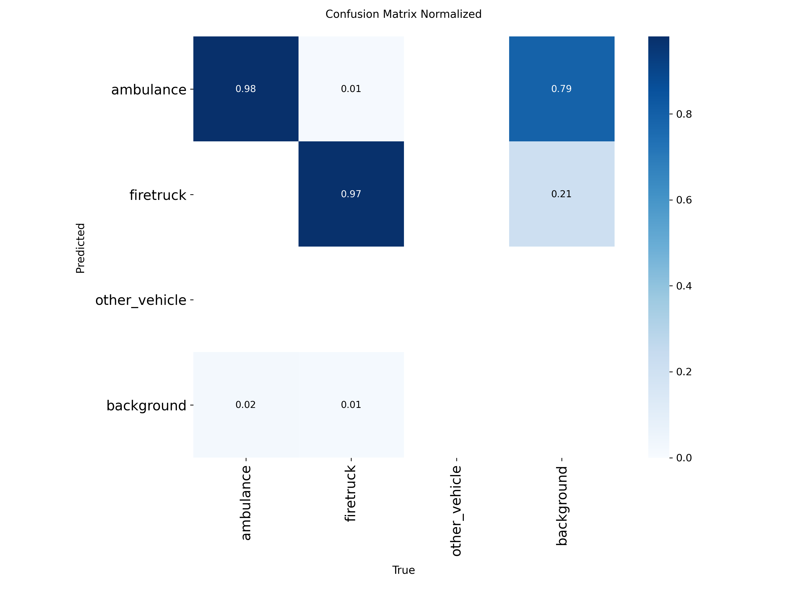
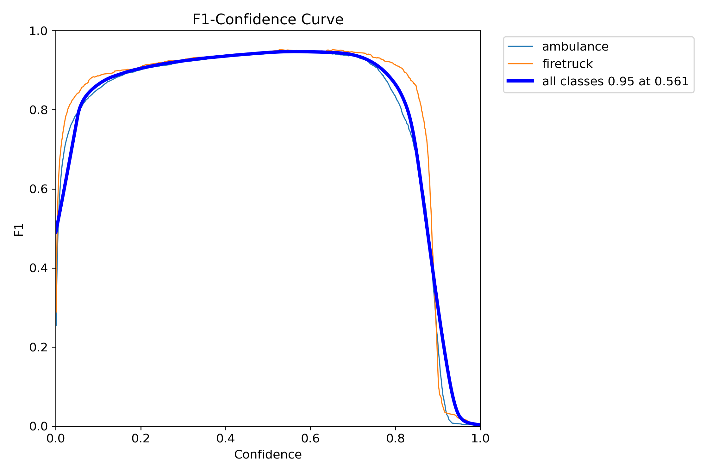
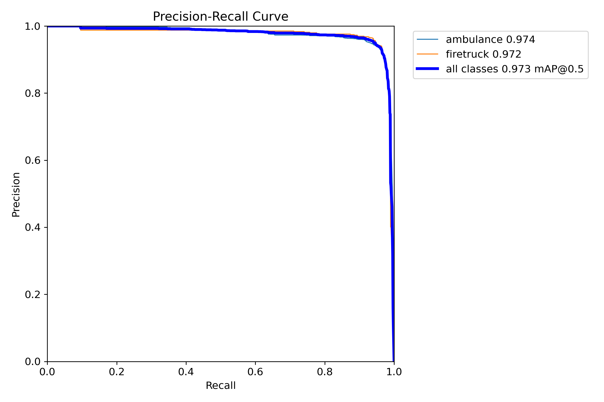

# ***Autonomous Emergency Vehicle Traffic Prioritization System***

An artificial intelligence-driven, real-time traffic prioritization system deployed at localized intersection edge nodes using an asynchronous multi-camera computer vision architecture. This project uses a custom-trained **YOLO11 Nano** model to detect emergency vehicles (Ambulance, Firetruck) and applies kinetic physics to schedule preemptive green-light overrides.



---

## ***Features***

- **Multi-Node Vision Inference Engine:** Simultaneously ingests and processes synchronous multi-channel tensors (North, South, East, West approach nodes) via OpenCV and FastAPI.
- **YOLO11n + Bot-SORT Tracking:** Heavily finetuned, achieving a **97.31\% mAP50** against structural dataset occlusion.
- **Kinematic Priority Scheduler:** Dynamically computes Estimated Times of Arrival (ETA) based on vehicle momentum to construct proactive 10-second intersection clearance phases.
- **Conflict Resolution Engine:** Advanced Tie-Breaker architecture effectively resolving identical EV incursions using $Priority Score \rightarrow Raw ETA \rightarrow Self-Emergency Score$ logic.

## ***Performance and Baselines***

Our custom-trained YOLO11n integration drastically surpassed generic models by directly addressing domain transfer instability. 

| Model Architecture | Model Scale | mAP@50 | Routing Suitability |
| :--- | :--- | :--- | :--- |
| Faster R-CNN (ResNet50) | ~41M | ~85%-90% | Latency Bottleneck |
| MobileNet-SSD | ~5M | ~65%-70% | Poor Distance Mapping |
| YOLOv8n (Generalization Base)| ~3.2M | ~82%-85% | Nominal Baseline |
| **YOLO11 Custom (Ours)** | **<3.0M**| **97.31%** | **Better**|

### Model Inferences

*Actual bounding box predictions rendered over evaluation validations proving edge detection accuracy.*

### Training Metrics & Confidence
Our model trained efficiently for 100 epochs on a specialized EMS dataset, mitigating cross-class inference collisions.

<p align="center">
  
   
</p>

<p align="center">
  
   
</p>

---

## ***How to Run the Model***

### 1. Prerequisites

Ensure you have Python 3.9+ and pip installed. We recommend creating an isolated Virtual Environment.

```bash
python -m venv venv
source venv/bin/activate  # On Windows use `venv\Scripts\activate`
```

### 2. Install Dependencies

Install the requirements necessary for FastAPI, Ultralytics YOLO, and OpenCV processing. Install dependencies from the directory:

```bash
cd Autonomous-traffic-router-for-EV-main
pip install -r requirements.txt
```
*(If you need core modules explicitly: `pip install ultralytics fastapi uvicorn opencv-python pydantic`)*

### 3. Start the Backend Server

The application runs an asynchronous inference loop utilizing Uvicorn. Navigate to the `cv_bend` folder that houses `main.py` and boot the development server:

```bash
cd cv_bend
uvicorn main:app --reload --host 0.0.0.0 --port 8000
```

### 4. Start the Frontend Dashboard

The visual interface is built with React. Open a new terminal instance (leave the backend running) and start the frontend development server:

```bash
cd Autonomous-traffic-router-for-EV-main/cv_fend/my-app
npm install
npm start
```

The dashboard will automatically launch in your default browser at `http://localhost:3000`.

### 5. Feed Network Traffic
Once the backend is initialized on port `8000` and the frontend on port `3000`, the dashboard will interface directly with the `/detect_v2` API endpoint. You can pipe sequential camera frames via the frontend UI to instantly visualize the real-time parsing, priority scoring, and the generated macroscopic traffic schedules.

---

## ***Failure Analysis and Limitations***
- **Real-Time Live Feeds**: Current logic encounters minor hardware desyncing constraints when attempting to digest continuous 4-route uncompressed feeds simultaneously.
- **Dataset Scale**: Trained primarily on a 3,000-image dataset constraint, making it vulnerable to edge-case phenomena like dense occlusions and extreme lighting blowouts from nighttime EV strobes.

## ***Future Scope***
- **YOLO26 Zero-NMS Integration**: Transitioning to zero-NMS pipelines to bypass immediate latency bottlenecks for flawless live-feed routing.
- **Sensor Fusion**: Coupling the 2D optical logic with LiDAR and local Radar points to bypass single-camera spatial distance anomalies.
- **V2X Telemetry**: Enabling hardware-first logic where EVs directly ping coordinates dynamically over RF/network layers, bypassing visual failure boundaries.
